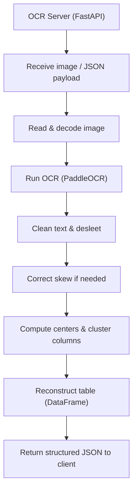

# ocr_ticketing (Server side)

# Ticket OCR App

This project is a Flutter application that allows users to capture photos of tickets/receipts, send them to a server for processing, and receive structured ticket data for storage and analysis.

---

## Architecture Overview

# Server-Side Ticket OCR and Processing

This server-side component is responsible for **receiving ticket images from the Flutter app**, performing **OCR (Optical Character Recognition)**, cleaning and structuring the extracted text, and returning a **table of ticket data** back to the client.

---

## Key Responsibilities

1. **Receive Images**
   - Handles image bytes sent from the Flutter frontend.
   - Reads images using OpenCV (`cv2`) and converts them to a NumPy array.

2. **OCR Processing**
   - Uses **PaddleOCR** for text detection and recognition.
   - Supports multiple languages (e.g., Spanish, English).
   - Handles timeouts and asynchronous execution for efficient processing.

3. **Text Cleaning & Normalization**
   - Corrects "leet" characters (`4 → A`, `3 → E`, etc.) using `desleet_text`.
   - Removes unwanted symbols and normalizes characters for consistent processing.
   - Converts OCR outputs to clean, structured text.

4. **Skew Detection & Correction**
   - Estimates global image skew from OCR bounding boxes.
   - Rotates both image and bounding boxes to align text horizontally.
   - Ensures accurate table reconstruction.

5. **Clustering & Table Reconstruction**
   - Computes **centers of OCR bounding boxes** and clusters them:
     - Vertically to detect columns.
     - Horizontally to detect rows.
   - Uses algorithms like **DBSCAN** and custom heuristics to align text.
   - Builds structured **tables (Pandas DataFrames)** representing ticket content.

6. **Visualization & Debugging**
   - Draws bounding boxes, centers, and cluster connections on images for debugging.
   - Logs system resource usage during processing.

7. **Utilities & Memory Management**
   - Converts NumPy types to standard Python types for JSON serialization.
   - Cleans memory and clears GPU cache to maintain performance.

---

## Workflow Summary

1. **Image Input:** Image received from Flutter app → converted to NumPy array.
2. **OCR Execution:** PaddleOCR detects text and bounding boxes.
3. **Text Processing:** Clean and normalize detected text, correct leet substitutions.
4. **Skew Correction:** Estimate rotation angle → rotate image & bounding boxes.
5. **Clustering:** Group text boxes into rows and columns to reconstruct tables.
6. **Table Construction:** Merge words per row/column → generate structured DataFrame.
7. **Return Data:** Processed ticket table sent back to the app as JSON.

---

## Technologies & Libraries

- **OCR:** PaddleOCR  
- **Image Processing:** OpenCV (`cv2`), NumPy  
- **Clustering & Analysis:** DBSCAN, math, collections  
- **Data Handling:** Pandas  
- **Asynchronous Execution:** asyncio  
- **System & Performance:** psutil, torch (for GPU memory cleanup)  
- **Logging & Debugging:** Python `logging`  

---

This server-side module ensures **accurate, structured extraction of ticket information**, enabling the Flutter app to display and store organized ticket data for the user.
